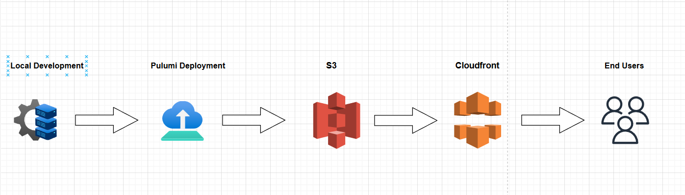
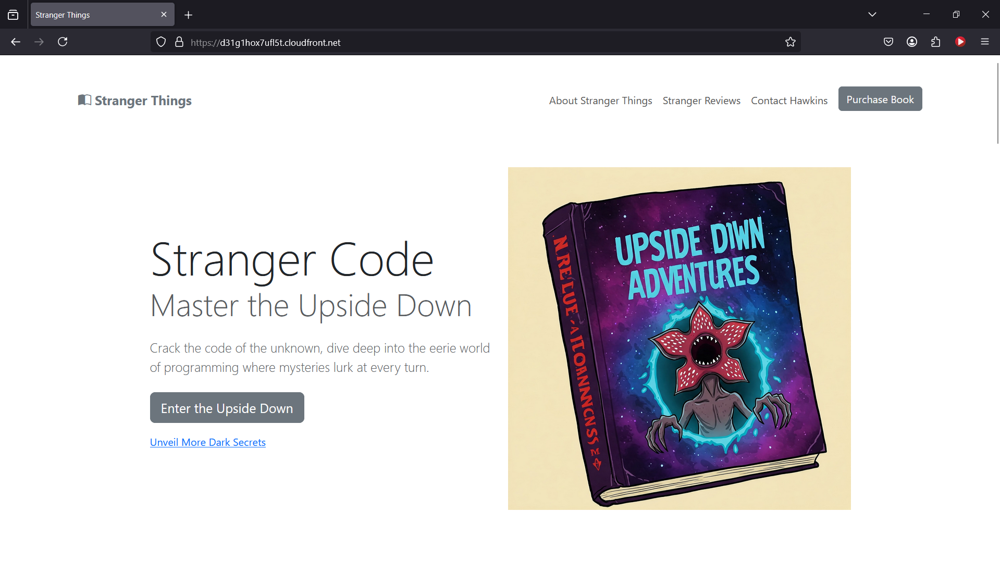

# 1. Project Overview

> Project Title
**Fast Static Website Deployment with Pulumi**

> Overview
This project demonstrates a fast static website deployment using AWS S3 and CloudFront, orchestrated through Pulumi’s Infrastructure as Code (IaC) platform. The goal is to build a fully automated, globally distributed website hosting solution using HTML, CSS, and JavaScript for the frontend, while leveraging Pulumi to streamline the deployment process. The project addresses challenges such as configuring public access for static assets and integrating a CDN for performance and security improvements.

> Motivation
I built this project as part of the Pulumi Deploy and Document Challenge to showcase my cloud engineering skills and demonstrate how modern IaC tools can simplify the deployment process. My focus was on creating a solution that is not only functional and performant, but also well-documented for both technical and non-technical audiences.

<p>&nbsp;</p>
---


# 2. Tools & Technologies

**Cloud Provider**
- **AWS S3:** Hosting static website assets
- **AWS CloudFront:** Delivering content with low latency and HTTPS support

**Infrastructure as Code**
- **Pulumi (TypeScript):** Automating the deployment process

**Web Development**
- **HTML, CSS, JavaScript:** Building the static website

**Other Tools**
- **AWS CLI & Git:** For deployment and version control
- **Diagram Tools:** For creating architecture diagrams (e.g., Draw.io, Figma)

<p>&nbsp;</p>
---


# 3. Architecture & Deployment Diagram

> Description:

The architecture consists of three main components:

- **Local Development:** Where the static website (HTML/CSS/JS) is developed and tested.
- **AWS S3 Bucket:** Stores the website assets and is configured for static website hosting.
- **AWS CloudFront Distribution:** Acts as a CDN to serve the website content globally over HTTPS.

> Diagram:

Below is the diagram that illustrates the complete workflow:



*Diagram Explanation:*  
1. **Local Development:** Code is developed and tested locally.  
2. **Pulumi Deployment:** The Pulumi script automates the deployment process.  
3. **AWS S3 Bucket:** Website assets are uploaded to S3 with website configuration enabled.  
4. **AWS CloudFront Distribution:** CloudFront caches and serves the website content securely over HTTPS to end users.  
5. **End Users:** Users access the website via the CloudFront URL.

<p>&nbsp;</p>
---


# 4. Development & Deployment Journey

> Planning and Setup  
I began by outlining the project requirements and selecting the **Static Website Deployment** prompt from the **Pulumi Deploy and Document Challenge**. The initial steps involved:  
- Setting up a **Git repository**  
- Creating a **Pulumi account**  
- Installing the **Pulumi CLI**  
- Choosing **AWS** as the cloud provider, using **S3** for hosting and **CloudFront** for performance and security.  

> Website Development  
The static website was built using **HTML, CSS, and JavaScript**. Key considerations:  
- Optimized assets (images, fonts, scripts) for **faster delivery**  
- Ensured **responsive design** across multiple devices  
- Tested locally to confirm proper functionality before deployment  

> Pulumi Integration  
Transitioning to **Infrastructure as Code (IaC)**, I initialized a **Pulumi project** and wrote a Pulumi script to:  
- **Provision an S3 bucket** with static website configuration and public-read access  
- **Set up a CloudFront distribution** to serve content securely over HTTPS  

> Challenges & Solutions  
I encountered challenges while handling **deprecated properties in Pulumi AWS provider** and **configuring ACLs/public access settings**. These were resolved by:  
- Adjusting **S3 bucket settings**  
- Implementing `BucketPublicAccessBlock` to allow controlled public access  

 Deployment  
The final deployment was executed using: 
``` 
pulumi up
```

<p>&nbsp;</p>
---


# 5. Code Walkthrough

For a complete view of the deployment code, please refer to the [`index.ts`](./index.ts) file in this repository. Below, I highlight the key sections of the code and explain their purpose.

 S3 Bucket & Website Configuration
This section creates an S3 bucket configured for static website hosting and sets the access level to `public-read`:
```typescript
// S3 Bucket & Website Configuration
const bucket = new aws.s3.BucketV2("my-bucket", {
    acl: "public-read",
    websites: [{
        indexDocument: "index.html",
        errorDocument: "404.html",
    }],
});
```
<p>&nbsp;</p>
---


# 6. Testing & Final Adjustments

**Testing:**  
After deployment, I conducted extensive testing to ensure the website's functionality, performance, and security:

- **Device Testing:**  
  The website was accessed on multiple devices including laptops, smartphones, and tablets, using various browsers such as Chrome, Firefox, and Safari.

- **Performance Testing:**  
  I verified that the CloudFront distribution effectively cached the content and that HTTPS redirection was working correctly, ensuring fast and secure delivery.

- **Security Review:**  
  I reviewed the S3 bucket and CloudFront configurations to confirm that the appropriate public access policies were in place, minimizing any security risks while allowing public access.

**Adjustments:**  
Based on the testing feedback, I made minor tweaks to the caching settings and confirmed that the website loaded without errors (e.g., resolving previous 403 Forbidden issues).

Laptop preview :


Mobile preview :


<p>&nbsp;</p>
---


# 7. Lessons Learned & Future Improvements

 Lessons Learned
- **Automation is Key:**  
  Automating infrastructure deployment with Pulumi greatly reduces manual configuration errors.
- **Attention to Detail:**  
  Handling case-sensitive file names (e.g., ensuring `index.html` is correctly named) is crucial.
- **Iterative Testing:**  
  Continuous testing across devices helped catch issues early.

 Future Improvements
- **CI/CD Pipeline:**  
  Integrate a continuous deployment process to automate future updates.
- **Enhanced Security:**  
  Explore additional security settings in CloudFront and S3.
- **Performance Optimization:**  
  Experiment with advanced CloudFront caching policies and custom SSL certificates for even better performance.

<p>&nbsp;</p>
---


# 8. Conclusion & Next Steps

 Conclusion
This project demonstrates a robust approach to deploying a static website using modern cloud infrastructure tools. Leveraging AWS S3, CloudFront, and Pulumi, the deployment process was automated and optimized for both performance and security. This submission is a testament to how Infrastructure as Code can simplify and enhance the deployment workflow.

 Next Steps
- **Live Site:**  
  Check out the live site here: [CloudFront URL](https://d31g1hox7ufl5t.cloudfront.net)
- **Detailed Blog Post:**  
  For a deeper dive into my process and challenges, read my blog post on Medium: [Dev Blog Link]()

<p>&nbsp;</p>
---


# 9. Links & References

- **Live Site:** [CloudFront URL](https://d31g1hox7ufl5t.cloudfront.net)
- **Pulumi Documentation:** [Pulumi Docs](https://www.pulumi.com/docs/)
- **AWS S3 & CloudFront:** [AWS Documentation](https://aws.amazon.com/documentation/)


Finally! Thank U Dev community for this amazing challenge, learned some new things <-_->